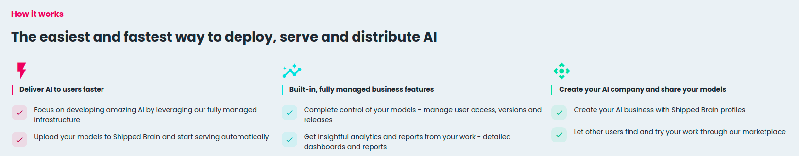

## `shippedbrain`
### Client library to publish models on [app.shippedbrain.com](app.shippedbrain.com)
Create **serverless REST endpoints** for machine learning models and get **hosted web pages** instantly.

`pip install shippedbrain`

**Seteup**

To upload models to _**shippedbrain**_ you must configure the `api` and `uploads` urls in `shippedbrain/__init__.py`.
```python
LOGIN_URL = "" # https://app.shippedbrain.com/api/v0/login
UPLOAD_URL = "" # https://app.shippedbrain.com/uploads/deploy
```

#### Using the CLI:

`shippedbrain upload --model_name My-Amazing-Model --run_id 6f252757005748708cd3aad75d1ff462`

#### Using the Python API:

Uploading a logged mlflow model from and existing `run_id` using the `shippedbrain.upload_run` function
```python
import pandas as pd
from sklearn import datasets
from sklearn.ensemble import RandomForestClassifier
import mlflow
import numpy as np
import mlflow.sklearn
from mlflow.models.signature import infer_signature

from shippedbrain import shippedbrain

iris = datasets.load_iris()
iris_train = pd.DataFrame(iris.data, columns=iris.feature_names)

    # each input has shape (4, 4)
input_example = input_example = iris_train.head()
    
with mlflow.start_run(run_name="YOUR_RUN_NAME") as run:
    clf = RandomForestClassifier(max_depth=7, random_state=0)
    clf.fit(iris_train, iris.target)
    signature = infer_signature(iris_train, clf.predict(iris_train))
    mlflow.sklearn.log_model(clf, "iris_rf", signature=signature, input_example=input_example)
    
shippedbrain.upload_run(
      run_id=run.info.run_id,
      email="YOUR_EMAIL", # can be left blank if env. var. SHIPPED_BRAIN_EMAIL is set
      password="YOUR_PASSWORD", # can be left blank if env. var. SHIPPED_BRAIN_PASSWORD is set
      model_name="YOUR_MODEL_NAME"
  )
```

Uploading a Random Forest model in scikit-learn using the `shippedbrain.upload_model` function
```python
from shippedbrain import shippedbrain
import pandas as pd
from sklearn import datasets
from sklearn.ensemble import RandomForestClassifier
from mlflow.models.signature import infer_signature

iris = datasets.load_iris()
iris_train = pd.DataFrame(iris.data, columns=iris.feature_names)
clf = RandomForestClassifier(max_depth=7, random_state=0)
clf.fit(iris_train, iris.target)

signature = infer_signature(iris_train, clf.predict(iris_train))

input_example = {
  "sepal length (cm)": 5.1,
  "sepal width (cm)": 3.5,
  "petal length (cm)": 1.4,
  "petal width (cm)": 0.2
}

# Upload the sklearn model
shippedbrain.upload_model(
    email="YOUR_EMAIL", # can be left blank if env. var. SHIPPED_BRAIN_EMAIL is set
    password="YOUR_PASSWORD", # can be left blank if env. var. SHIPPED_BRAIN_PASSWORD is set
    model_name="MODEL_NAME",
    signature=signature,
    input_example=input_example,
    sk_model=clf, # named arg. required by mlflow.sklearn.log_model
    artifact_path="sklearn-model" # named arg. required by mlflow.sklearn.log_model
)
```

# Shipped Brain
[Shipped Brain](shippedbrain.com) is an AI platform that allows anyone to share and upload machine learning models fast and easily.



## Managed REST API endpoints
### Use anywhere
When a model is published on [app.shippedbrain.com](app.shippedbrain.com) it gets its unique and standardized REST API endpoint automatically that can be embedded anywhere.

To use a shipped brain model you just need to make an HTTP POST request to the model's endpoint:

```app.shippedbrain.com/api/v0/<your-model-name>/<version>```

* Straightforward deployments with one line of code 
* Public REST endpoints that anyone can try and verify - managed for you
* No serving code and zero configuration

## Hosted Model Pages
### Interactive web pages to get started easily
An interactive web page for every model - automatically created and hosted for you.

Share your models' web pages and allow anyone to experiment with your models in the browser or using the REST API.

* An interactive web page for every model - automatically created and hosted for you
* In-app experimentation using model input examples
* Auto-generated model signatures on your models' web pages


## Data Science Portfolio
### Build a home for your AI

Start creating your data science portfolio. Share you Shipped Brain profile with other AI specialists, companies or include it in your resumé. Your shipped brain profiles is a great way to showcase all your models.

* Leverage Shipped Brain's profiles and infrastructure to manage your online presence as an AI specialist
* Share your profile and models on social media platforms with one click


## About `shippedbrain`
The `shippedbrain` client library provides a convenient way to publish models on [app.shippedbrain.com](app.shippedbrain.com).

It integrates with the widely used `mlflow` library, so any `mlflow` model will work on shipped brain.

### Model Publish Workflows
There are 2 main ways in which you can publish models onto shipped brain:
* Publish a trained model using the `shippedbrain.upload_model` function
* Publish a model from an existing `mlfow` logged model run, via the CLI command `shippedbrain upload` or Python API using the `shippedbrain.upload_run` function

> For more information on how to log models with `mlflow`read the [documentation](https://www.mlflow.org/docs/latest/models.html)

## Usage
The `shippedbrain` client library has a **Python API** and **CLI** flavors.

##### Use environment variables to set your shipped brain email and password (advised)
* `SHIPPED_BRAIN_EMAIL`
* `SHIPPED_BRAIN_PASSWORD`

#### Shipped Brain models signature and input example
All models published on [app.shippedbrain.com](app.shippedbrain.com) have a valid **mlflow** `input_example` and `signature`

When working with ML models you often need to know some basic functional properties of the model at hand, such as “What inputs does it expect?” and “What output does it produce?”. MLflow models can include the following additional metadata about model inputs and outputs that can be used by downstream tooling:
* [Model Signature](https://mlflow.org/docs/latest/models.html#model-signature) - description of a model’s inputs and outputs. 
* [Model Input Example](https://mlflow.org/docs/latest/models.html#input-example) - example of a valid model input.


### CLI
`shippedbrain [OPTIONS] COMMAND [ARGS]...`

#### Commands

`upload` - Deploy a model to [app.shippedbrain.com](app.shippedbrain.com) : create a REST endpoint and hosted model page


#### `upload` command
Deploy a model to [app.shippedbrain.com](app.shippedbrain.com) - create a REST endpoint and get a hosted model web page

##### Options:

* `-r`, `--run_id` (**TEXT**) - The run_id of logged mlflow model  [required]
* `-m`, `--model_name` (**TEXT**) - The model name to display on [app.shippedbrain.com](app.shippedbrain.com) [required]
* `-f`, `--flavor` (**TEXT**) - The mlflow flow flavor of the model
* `--help` - Get help on how to use the 'upload' command

**NB:** The model must have been logged with valid `input_example` and `signature`. For more information refer to the official mlflow documentation:
* [MLflow Model Input Example](https://mlflow.org/docs/latest/models.html#input-example)
* [MLflow Model Signature](https://mlflow.org/docs/latest/models.html#model-signature)

##### Example:
Run:

`shippedbrain upload --run_id <some_run_id> --model_name <my-model-name>`

Prompt:

The command above will prompt the user to input their shipped brain email and password.
```
email: your@email.com
password: 
```

If the environment variables `SHIPPED_BRAIN_EMAIL` or `SHIPPED_BRAIN_PASSWORD` are set, the respective prompt options will be skipped.

Example:

`shippedbrain upload --run_id 6f252757005748708cd3aad75d1ff462 --model_name Some-Model-Name`

### Python API
To publish a model programmatically you can either use the `shippedbrain.upload_run` or  `shippedbrain.upload_model` functions.

####`shippedbrain.upload_run`
Publish a model from an existing `mlflow` log model run. 
##### Arguments:
* `run_id` (**str**) - run_id of logged model `mlflow` run
* `email` (**str**) - shipped brain account email; if `SHIPPED_BRAIN_EMAIL` is set, argument can be left blank
* `password` (**str**) - shipped brain account password; if `SHIPPED_BRAIN_PASSWORD` is set, argument can be left blank
* `model_name` (**str**) - model name to display on [app.shippedbrain.com](app.shippedbrain.com)

##### Example
```python
from shippedbrain import shippedbrain
from sklearn.ensemble import RandomForestRegressor
import mlflow

with mlflow.start_run(run_name="YOUR_RUN_NAME") as run:
  params = {"n_estimators": 5, "random_state": 42}
  sk_learn_rfr = RandomForestRegressor(**params)

  shippedbrain.upload_run(
    run_id=run.info.run_id,
    email="YOUR_EMAIL", # can be left blank if env. var. SHIPPED_BRAIN_EMAIL is set
    password="YOUR_PASSWORD", # can be left blank if env. var. SHIPPED_BRAIN_PASSWORD is set
    model_name="YOUR_MODEL_NAME"
  )
```

####`shippedbrain.upload_model`
Publish a trained model directly to [app.shippedbrain.com](app.shippedbrain.com). 
##### Arguments:
* `flavor`: (**str**) - valid mlflow model flavor; refer to the [original mlflow documentation](https://mlflow.org/docs/latest/python_api/index.html#python-api)
* `email` (**str**) - shipped brain account email; if "SHIPPED_BRAIN_EMAIL" is set, argument can be left blank
* `password` (**str**) - shipped brain account password; if "SHIPPED_BRAIN_PASSWORD" is set, argument can be left blank
* `model_name` (**str**) - model name to display on [app.shippedbrain.com](app.shippedbrain.com)
* `input_example` (**pandas.DataFrames | numpy.ndarrays**)- model inputs can be column-based (i.e DataFrames) or tensor-based (i.e numpy.ndarrays). A model input example provides an instance of a valid model input. More info. in [MLflow Model Input Example](https://mlflow.org/docs/latest/models.html#input-example)
* `signature` (**mlflow.types.schema.Schema**) - the Model signature defines the schema of a model’s inputs and outputs. Model inputs and outputs can be either column-based or tensor-based. Column-based inputs and outputs can be described as a sequence of (optionally) named columns with type specified. ModelSignature can be [inferred](https://mlflow.org/docs/latest/python_api/mlflow.models.html#mlflow.models.infer_signature) from training dataset and model predictions using or constructed by hand by passing an input and output (Schema)[https://mlflow.org/docs/latest/python_api/mlflow.types.html#mlflow.types.Schema].

  More info in [MLflow Model Signature](https://mlflow.org/docs/latest/models.html#model-signature)
* `**kwargs` - named arguments required by the selected `flavor`

The `kwargs` arguments depends on the `flavor` argument. Please verify the required named arguments of the select flavor in [MLflow Python API](https://mlflow.org/docs/latest/python_api/index.html#python-api).

##### Example
```python
from shippedbrain import shippedbrain
import pandas as pd
from sklearn import datasets
from sklearn.ensemble import RandomForestClassifier
from mlflow.models.signature import infer_signature

iris = datasets.load_iris()
iris_train = pd.DataFrame(iris.data, columns=iris.feature_names)
clf = RandomForestClassifier(max_depth=7, random_state=0)
clf.fit(iris_train, iris.target)

signature = infer_signature(iris_train, clf.predict(iris_train))

input_example = {
  "sepal length (cm)": 5.1,
  "sepal width (cm)": 3.5,
  "petal length (cm)": 1.4,
  "petal width (cm)": 0.2
}

# Upload the sklearn model
shippedbrain.upload_model(
    email="YOUR_EMAIL", # can be left blank if env. var. SHIPPED_BRAIN_EMAIL is set
    password="YOUR_PASSWORD", # can be left blank if env. var. SHIPPED_BRAIN_PASSWORD is set
    model_name="MODEL_NAME",
    signature=signature,
    input_example=input_example,
    sk_model=clf,
    artifact_path="sklearn-model"
)
```

### Run and end-to-end example from this repo
You can find an example under the `./examples/elastic_net` directory.
* `train_and_log.py`: trains linear model and logs it to mlflow
* `requirements.txt`: python requirements to run example

Before running the `./examples/elastic_net/train_and_log.py` script you should update the following variables:
* `SHIPPED_BRAIN_EMAIL` with your shipped brain account email
* `SHIPPED_BRAIN_PASSWORD` with your shipped brain account password
* `MODEL_NAME` with the name of your published model on shipped brain 

Run the example:
* Install the requirements: `pip install -r ./examples/elastic_net/`
* Train and publish the model: `python ./examples/elastic_net/train_and_log.py --publish`

You can omit the `--publish` flag if you do not want your model to be published on [app.shippedbrain.com](app.shippedbrain.com)

#### Using the CLI
To upload the trained model to [app.shippedbrain.com](app.shippedbrain.com) you just need to collect the `run_id` of the logged model:
* `--model_name` - specify the model name published on [app.shippedbrain.com](app.shippedbrain.com)
* `--run_id` - the **run_id** of the logged model 

Run: `shippedbrain upload --model_name ElasticWine --run_id <some_run_id>`

#### Typical workflow integration using the Python API

If `SHIPPED_BRAIN_EMAIL` and/or `SHIPPED_BRAIN_PASSWORD` are set arguments `email` and `password` can be left blank, respectively

```python
import mlflow
from shippedbrain import shippedbrain

# other imports...

SHIPPED_BRAIN_EMAIL = "your_email@mail.com"
SHIPPED_BRAIN_PASSWORD = "your_password"
MODEL_NAME = "ElasticWine"

with mlflow.start_run() as run:
    # required to upload a valid model on shipped brain
    signature =  # use mlflow.models.signature.infer_signature
    input_example =  # one input example of your data Union[pandas.DataFrame | numpy.ndarray] 

    # train model
    model =  # trained model

    # log model
    mlflow.sklearn.log_model(model, "model", signature=signature, input_example=input_example)
    print(f"run_id='{run.info.run_id}'")

    # publish model
    shippedbrain.upload_run(email=SHIPPED_BRAIN_EMAIL, password=SHIPPED_BRAIN_PASSWORD, run_id=run.info.run_id,
                            model_name=MODEL_NAME)
```